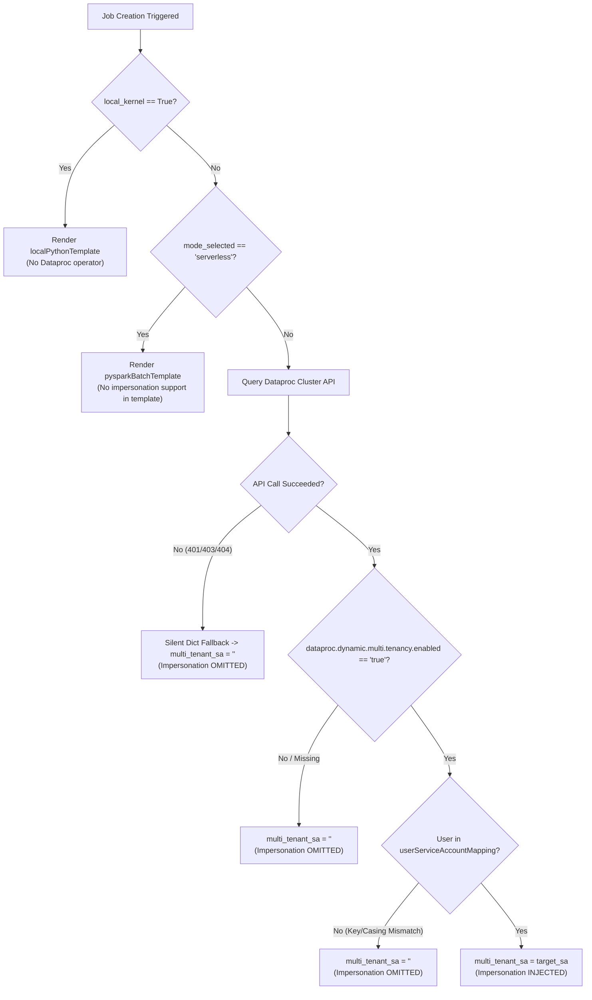

# Scheduler Jupyter Plugin Diagnostics

[](LICENSE)
[](https://www.python.org/downloads/)

A lightweight, production-grade diagnostic CLI and DAG validation tool for **JupyterLab Scheduler Plugin**, **Cloud Composer**, and **Dataproc Dynamic Multi-Tenancy**.

---

## 🎯 Overview

When scheduling Jupyter notebooks to run on multi-tenant Dataproc clusters via Cloud Composer, Cloud Composer's worker service account must impersonate the specific end-user's service account using `impersonation_chain=['<user-sa>']` in `DataprocSubmitJobOperator`.

However, the Airflow DAG generation template wraps impersonation inside a conditional check:
```jinja

impersonation_chain=['{{multi_tenant_service_account}}'],

```
If `multi_tenant_service_account` evaluates to an empty string (`""`), the template **silently omits** the impersonation chain without raising any errors or warnings.

This tool provides:
1. **Pre-flight Environment Diagnostics** (`diagnose`): Validates Dataproc multi-tenancy properties, `userServiceAccountMapping`, active identity, and IAM Token Creator permissions.
2. **Dry-Run DAG Rendering** (`render`): Generates and inspects Airflow DAG files locally without uploading to Cloud Storage.
3. **Automated 6-Scenario Test Matrix** (`test-matrix`): Simulates and validates nominal and failure scenarios.
4. **Hybrid Bridge Support** (`--installed-plugin`): Runs either as a standalone engine or directly invokes the VM's pre-installed `scheduler_jupyter_plugin` package.

---

## 🏗️ Architecture & Decision Logic



---

## 💻 Installation & Usage in Vertex AI Workbench (Notebook Terminal)

Follow these steps to run diagnostics directly inside any Google Cloud Vertex AI Workbench Notebook instance:

### Step 1: Open Terminal in JupyterLab
1. Open your Workbench instance in Google Cloud Console.
2. Click **File** → **New** → **Terminal**.

### Step 2: Clone or Upload the Repository
```bash
# Option A: Clone from GitHub inside notebook terminal
git clone https://github.com/Royston88/scheduler-jupyter-plugin-diagnostics.git
cd scheduler-jupyter-plugin-diagnostics

# Option B: (If uploading via gcloud SCP from your local machine)
# gcloud compute scp --recurse ./scheduler-jupyter-plugin-diagnostics <NOTEBOOK_INSTANCE_NAME>:/home/jupyter/ --zone=<ZONE>
```

### Step 3: Install into Notebook Runtime
Workbench JupyterLab runs in a managed environment (`/opt/micromamba/envs/jupyterlab`). Install the CLI in editable mode:

```bash
/opt/micromamba/envs/jupyterlab/bin/python3 -m pip install -e .
```

### Step 4: Run Diagnostic Commands

#### 1. Pre-Flight Diagnostics (Using Installed Plugin Package)
Uses the notebook VM's real credentials and official `scheduler_jupyter_plugin` code:
```bash
/opt/micromamba/envs/jupyterlab/bin/python3 -m dataproc_scheduler_diagnostics.cli diagnose \
    --cluster=my-dataproc-multitenant-cluster \
    --installed-plugin
```

#### 2. Dry-Run Render Airflow DAG & Inspect Impersonation
```bash
/opt/micromamba/envs/jupyterlab/bin/python3 -m dataproc_scheduler_diagnostics.cli render \
    --job-name="my-spark-job" \
    --notebook="Basic Spark.ipynb" \
    --cluster=my-dataproc-multitenant-cluster \
    --output-file="./test_dag.py"
```

#### 3. Run the 6-Scenario Test Matrix
```bash
/opt/micromamba/envs/jupyterlab/bin/python3 -m dataproc_scheduler_diagnostics.cli test-matrix \
    --output-dir=./test_results
```

#### 4. Quick Smoke Test (Method 1 Helper Script)
```bash
/opt/micromamba/envs/jupyterlab/bin/python3 scripts/test_installed_plugin.py \
    --cluster=my-dataproc-multitenant-cluster
```

---

## 🖥️ Local Workstation Installation (Laptop / Cloudtop)

### 1. Install Package
```bash
git clone https://github.com/Royston88/scheduler-jupyter-plugin-diagnostics.git
cd scheduler-jupyter-plugin-diagnostics

pip install -e .
```

### 2. Prerequisites
* Python 3.9+
* `gcloud` authenticated with access to the target project and Dataproc cluster:
  ```bash
  gcloud auth login
  gcloud auth application-default login
  ```

### 3. Run Standalone CLI
```bash
scheduler-plugin-diag diagnose \
    --cluster=my-dataproc-multitenant-cluster \
    --project=my-gcp-project \
    --region=us-central1
```

---

## 🔍 Root Cause Troubleshooting Guide

| Issue Symptom | Underlying Cause | Remediation |
| :--- | :--- | :--- |
| **`impersonation_chain` missing in generated DAG** | Active `gcloud` account does not match key in `userServiceAccountMapping`. | Ensure `gcloud config get account` matches the exact email (case-sensitive) mapped during cluster creation. |
| **`impersonation_chain` missing on multi-tenant cluster** | Property `dataproc:dataproc.dynamic.multi.tenancy.enabled` is missing or not lowercase `"true"`. | Recreate cluster with `--properties=dataproc:dataproc.dynamic.multi.tenancy.enabled=true`. |
| **Airflow DAG fails with `PERMISSION_DENIED: Failed to impersonate`** | Composer Worker SA does not have `Token Creator` role on Target SA. | Grant `roles/iam.serviceAccountTokenCreator` to the Composer Service Account on the Target Service Account: <br/>`gcloud iam service-accounts add-iam-policy-binding <TARGET_SA> --member="serviceAccount:<COMPOSER_SA>" --role="roles/iam.serviceAccountTokenCreator"` |
| **Impersonation missing when running Serverless** | Serverless mode uses batch templates which do not support user impersonation chains. | Use Execution Mode: `Cluster` instead of `Serverless`. |

---

## 📄 License

This project is licensed under the Apache License 2.0 - see the [LICENSE](LICENSE) file for details.
