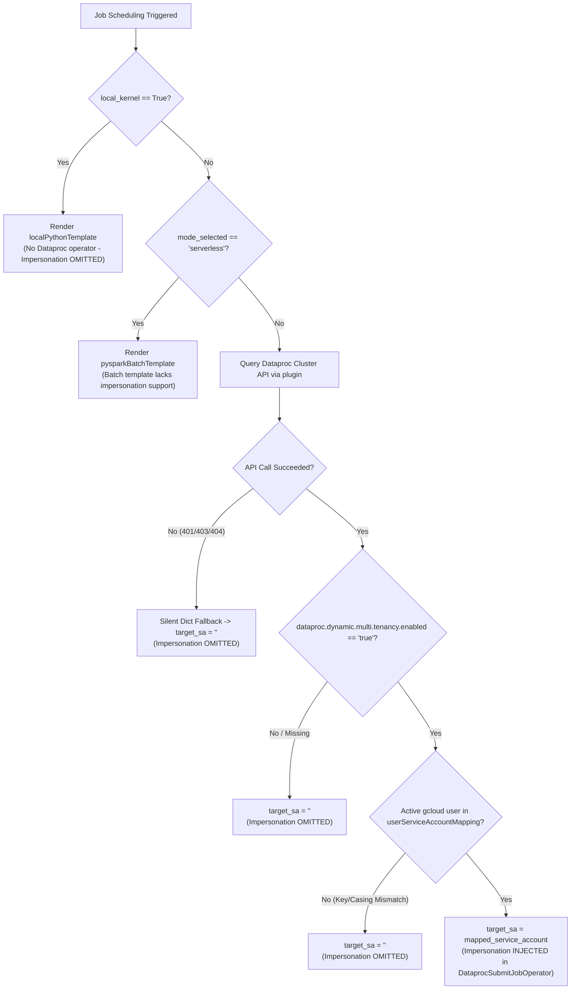

# Scheduler Jupyter Plugin Diagnostics CLI

[](LICENSE)
[](https://www.python.org/downloads/)

A pure, native diagnostic and dry-run CLI harness for the official **`scheduler_jupyter_plugin`** package installed on **Google Cloud Vertex AI Workbench**.

---

## 🎯 Overview & The Impersonation Challenge

When scheduling Jupyter notebooks to execute on multi-tenant Dataproc clusters via Cloud Composer, Cloud Composer's worker service account must impersonate the specific end-user's service account using `impersonation_chain=['<user-sa>']` in `DataprocSubmitJobOperator`.

However, the official Airflow DAG generation template inside the scheduler plugin wraps impersonation inside a conditional check:
```jinja

impersonation_chain=['{{multi_tenant_service_account}}'],

```

> [!WARNING]
> If `multi_tenant_service_account` evaluates to an empty string (`""`), the template **silently omits** the impersonation chain without raising any errors, warnings, or UI alerts. The job is then submitted under the default Dataproc VM service account rather than the intended end user's identity.

This CLI directly invokes the **official, installed `scheduler_jupyter_plugin` package** inside your Workbench notebook environment to audit, dry-run render, and live-schedule jobs with zero false positives.

---

## 🏗️ Architecture & Decision Logic

The flowchart below illustrates how the official `scheduler_jupyter_plugin` evaluates whether to inject or silently omit the `impersonation_chain`:



---

## 💻 Installation on Vertex AI Workbench (Notebook Terminal)

Follow these steps inside any Vertex AI Workbench Notebook instance:

### Step 1: Open Terminal in JupyterLab
1. In your JupyterLab top navigation bar, click **File** → **New** → **Terminal**.

### Step 2: Clone or Copy Repository
```bash
git clone https://github.com/Royston88/scheduler-jupyter-plugin-diagnostics.git /home/jupyter/scheduler-jupyter-plugin-diagnostics
cd /home/jupyter/scheduler-jupyter-plugin-diagnostics
```

*(Alternatively, download or upload the zip archive to `/home/jupyter/scheduler-jupyter-plugin-diagnostics`)*.

### Step 3: Install into Notebook Managed Python Environment

#### 🔍 Why install into the managed environment?
On Vertex AI Workbench:
* **JupyterLab Server & Extensions:** Google's official `scheduler_jupyter_plugin` and JupyterLab server run in a dedicated system environment:
  * JupyterLab 4 Instances: `/opt/conda/envs/jupyterlab4/bin/python3` (or `/opt/conda/envs/jupyterlab/bin/python3`)
  * Legacy / Micromamba Instances: `/opt/micromamba/envs/jupyterlab/bin/python3`
* **User Notebook Kernels:** Your notebook code runs in separate user conda environments (e.g. `base`, `pytorch`, `pyspark`).

To audit and test the exact code paths of the scheduler extension, the diagnostic tool must be registered in the **JupyterLab server environment**.

#### 🛡️ Safe Installation with `--no-deps -e`
* **`--no-deps`:** Guarantees that `pip` will **never** download, upgrade, downgrade, or overwrite any existing Google Cloud libraries or JupyterLab packages.
* **`-e` (Editable Mode):** Places a single `.pth` link in `site-packages` pointing to the source directory without copying files.

```bash
# For JupyterLab 4 / Conda environments (Default on modern Workbench instances):
/opt/conda/envs/jupyterlab4/bin/python3 -m pip install --no-deps -e .

# Alternatively, for Micromamba-managed instances:
# /opt/micromamba/envs/jupyterlab/bin/python3 -m pip install --no-deps -e .
```

---

## 🚀 Usage & Diagnostic Commands

Run commands using the same JupyterLab Python runtime:

```bash
# Set alias or variable for convenience
PYTHON_EXEC="/opt/conda/envs/jupyterlab4/bin/python3"
# (or "/opt/micromamba/envs/jupyterlab/bin/python3" if on micromamba)
```

### 1. Pre-Flight Diagnostic Audit (`diagnose`)
Validates Dataproc cluster accessibility, dynamic multi-tenancy properties, active gcloud user identity, and IAM Token Creator permissions directly through the installed plugin runtime:

```bash
$PYTHON_EXEC -m dataproc_scheduler_diagnostics.cli diagnose \
    --cluster=<DATAPROC_CLUSTER_NAME>
```

**Sample Output**:
```text
=================================================================
   NATIVE SCHEDULER PLUGIN PRE-FLIGHT & IMPERSONATION AUDIT      
=================================================================
Plugin Version : 0.1.7 (Official Installed Package)
Project ID     : my-gcp-project
Region ID      : us-central1
Target Cluster : my-dataproc-multitenant-cluster
Active Account : user-1@example.com
-----------------------------------------------------------------
1. Dataproc Cluster Accessible : [✓] PASS
2. Dynamic Multi-Tenancy Value : 'true'
   -> Multi-Tenancy Enabled    : [✓] PASS
3. User Mapping Configured     : {
  "user-1@example.com": "data-user-sa@my-gcp-project.iam.gserviceaccount.com"
}
4. Target Service Account      : 'data-user-sa@my-gcp-project.iam.gserviceaccount.com'
   -> Impersonation Chain Status: [✓] INJECTED (data-user-sa@my-gcp-project.iam.gserviceaccount.com)
5. Probing Token Creator IAM Permissions...
   -> Token Generation Test    : [✓] SUCCESS
=================================================================
```

---

### 2. Dry-Run Render Airflow DAG & Verify Impersonation (`render`)
Executes the official plugin's internal `prepare_dag()` pipeline locally. Renders the exact Airflow DAG Python code and verifies whether `impersonation_chain` is generated without uploading anything to Cloud Storage:

```bash
$PYTHON_EXEC -m dataproc_scheduler_diagnostics.cli render \
    --cluster=<DATAPROC_CLUSTER_NAME> \
    --composer-env=<COMPOSER_ENV_NAME> \
    --job-name="test-spark-job" \
    --notebook="notebook.ipynb"
```

**Key Parameters**:
- `--cluster`: Target Dataproc cluster name.
- `--composer-env`: Cloud Composer environment name.
- `--job-name`: Name identifier for the scheduled job (defaults to `scheduled-notebook-job`).
- `--notebook`: Name of the notebook file in the directory (defaults to `notebook.ipynb`).
- `--output-file`: (Optional) Local filepath to save the rendered Airflow DAG python script.
- `--mode`: (Optional) Execution mode: `cluster` (default) or `serverless`.
- `--local-kernel`: (Optional) Render DAG for execution inside the local Airflow worker container.

---

### 3. Live Schedule Job to Cloud Composer (`schedule`)
Executes the full end-to-end job creation, renders the DAG, and synchronizes the DAG and notebook payload to Cloud Composer's GCS bucket from the terminal:

```bash
$PYTHON_EXEC -m dataproc_scheduler_diagnostics.cli schedule \
    --cluster=<DATAPROC_CLUSTER_NAME> \
    --composer-env=<COMPOSER_ENV_NAME> \
    --job-name="daily-spark-analysis" \
    --notebook="notebook.ipynb"
```

---

## 📊 Impersonation Resolution Scenarios

| Scenario | Mode / Conditions | Target SA Resolved | Impersonation Injected | Reason / Mechanism |
| :--- | :--- | :---: | :---: | :--- |
| **Nominal Multi-Tenancy** | Cluster mode, Multi-tenancy enabled (`'true'`), Caller in mapping | `target-sa@...` | ✅ **INJECTED** | Matched `userServiceAccountMapping` key. `impersonation_chain=['<target-sa>']` written to DAG. |
| **User Identity Mismatch** | Cluster mode, Active `gcloud` account not in mapping table | `""` | ❌ **OMITTED** | Silent lookup miss in `userServiceAccountMapping`. Key is case-sensitive. |
| **Multi-Tenancy Disabled** | Cluster property `dataproc:dataproc.dynamic.multi.tenancy.enabled` is `false` or missing | `""` | ❌ **OMITTED** | Plugin skips mapping resolution when property is not the exact lowercase string `'true'`. |
| **Serverless Mode** | Serverless / Batch execution mode selected | `""` | ❌ **OMITTED** | Template `pysparkBatchTemplate-v1.txt` does not implement user impersonation chains. |
| **Local Kernel Mode** | `local_kernel == True` selected | `""` | ❌ **OMITTED** | Executes in Airflow worker container via `localPythonTemplate-v1.txt`. |
| **Dataproc API Failure** | Permission denied, expired token, or 401/403/404 on Dataproc API | `""` | ❌ **OMITTED** | Silent exception fallback returns empty dict, causing empty target SA string. |

---

## 🔍 Root Cause Troubleshooting Guide

| Issue Symptom | Underlying Cause in Plugin | Remediation |
| :--- | :--- | :--- |
| **`impersonation_chain` missing in generated DAG** | Active `gcloud` account does not match key in `userServiceAccountMapping`. | Ensure `gcloud config get account` matches the exact email (case-sensitive) mapped during cluster creation. |
| **`impersonation_chain` missing on multi-tenant cluster** | Property `dataproc:dataproc.dynamic.multi.tenancy.enabled` is missing or not lowercase `"true"`. | Recreate cluster with `--properties=dataproc:dataproc.dynamic.multi.tenancy.enabled=true`. |
| **Airflow DAG fails with `PERMISSION_DENIED: Failed to impersonate`** | Composer Worker SA does not have `Token Creator` role on Target SA. | Grant `roles/iam.serviceAccountTokenCreator` to the Composer Service Account on the Target Service Account: <br/>`gcloud iam service-accounts add-iam-policy-binding <TARGET_SA> --member="serviceAccount:<COMPOSER_SA>" --role="roles/iam.serviceAccountTokenCreator"` |
| **Impersonation missing when running Serverless** | Serverless mode uses batch templates which do not support user impersonation chains. | Use Execution Mode: `Cluster` instead of `Serverless`. |

---

## 🧹 Uninstallation

To completely remove the diagnostic tool and clean up the Workbench environment:

```bash
# 1. Uninstall the diagnostic package from the JupyterLab Python environment
/opt/conda/envs/jupyterlab4/bin/python3 -m pip uninstall -y scheduler-jupyter-plugin-diagnostics
# (or /opt/micromamba/envs/jupyterlab/bin/python3 -m pip uninstall -y scheduler-jupyter-plugin-diagnostics)

# 2. Delete the cloned/extracted repository directory
rm -rf /home/jupyter/scheduler-jupyter-plugin-diagnostics
```

---

## 📄 License

This project is licensed under the Apache License 2.0 - see the [LICENSE](LICENSE) file for details.
