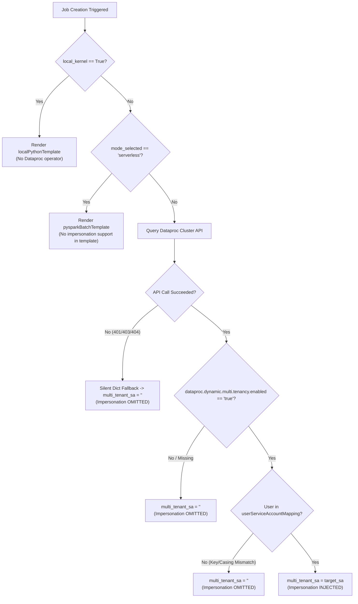

# Scheduler Jupyter Plugin Diagnostics

[](LICENSE)
[](https://www.python.org/downloads/)

A lightweight, standalone diagnostic CLI and DAG generation verification tool for **JupyterLab Scheduler Plugin**, **Cloud Composer**, and **Dataproc Dynamic Multi-Tenancy**.

---

## 🎯 Overview

When scheduling Jupyter notebooks to run on multi-tenant Dataproc clusters via Cloud Composer, Cloud Composer's worker service account must impersonate the specific end-user's service account using `impersonation_chain=['<user-sa>']` in `DataprocSubmitJobOperator`.

However, the Airflow DAG generation template wraps impersonation inside a conditional check:
```jinja

impersonation_chain=['{{multi_tenant_service_account}}'],

```
If `multi_tenant_service_account` evaluates to an empty string (`""`), the template **silently omits** the impersonation chain without raising any errors or warnings.

This tool provides:
1. **Pre-flight Environment Diagnostics** (`diagnose`): Validates Dataproc multi-tenancy properties, `userServiceAccountMapping`, active identity, and IAM Token Creator permissions.
2. **Dry-Run DAG Rendering** (`render`): Generates and inspects Airflow DAG files locally without uploading to Cloud Storage.
3. **Automated 6-Scenario Test Matrix** (`test-matrix`): Simulates and validates nominal and failure scenarios.

---

## 🏗️ Architecture & Decision Logic



---

## 📦 Installation & Setup

### 1. Install Dependencies
```bash
# Option A: Install editable CLI command
pip install -e .

# Option B: Install requirements directly
pip install -r requirements.txt
```

### 2. Prerequisites
* Python 3.9+
* `gcloud` authenticated with access to the target project and Dataproc cluster:
  ```bash
  gcloud auth login
  gcloud auth application-default login
  ```

---

## 🚀 Quickstart & Usage

### 1. Pre-Flight Diagnostic Audit
Audit the Dataproc cluster and verify if the active user correctly resolves to a target service account:

```bash
# If installed via pip:
scheduler-plugin-diag diagnose \
    --cluster=my-dataproc-multitenant-cluster \
    --project=my-gcp-project \
    --region=us-central1

# Or run directly via Python module:
PYTHONPATH=src python3 -m dataproc_scheduler_diagnostics.cli diagnose \
    --cluster=my-dataproc-multitenant-cluster \
    --project=my-gcp-project \
    --region=us-central1
```

**Sample Output**:
```text
=================================================================
     SCHEDULER PLUGIN PRE-FLIGHT & IMPERSONATION DIAGNOSTICS     
=================================================================
Project ID : my-gcp-project
Region ID  : us-central1
Cluster    : my-dataproc-multitenant-cluster
Active User: user-1@example.com
-----------------------------------------------------------------
1. Dataproc Cluster Accessible : [✓] PASS
2. Dynamic Multi-Tenancy Value : 'true'
   -> Evaluates to Enabled     : [✓] PASS
3. User Mapping Configured     : {
  "user-1@example.com": "data-user-sa@my-gcp-project.iam.gserviceaccount.com"
}
4. Target Service Account      : 'data-user-sa@my-gcp-project.iam.gserviceaccount.com'
   -> Impersonation Chain Status: [✓] INJECTED (data-user-sa@my-gcp-project.iam.gserviceaccount.com)
5. Probing Token Creator IAM Permissions...
   -> Token Generation Test    : [✓] SUCCESS
=================================================================
```

---

## 🧪 2. Dry-Run DAG Rendering
Render the Airflow DAG locally to verify parameters and syntax before scheduling:

```bash
scheduler-plugin-diag render \
    --job-name="daily-spark-etl" \
    --notebook="Basic Spark.ipynb" \
    --cluster="my-dataproc-multitenant-cluster" \
    --output-file="./output_dag.py"
```

---

## 📊 3. Run the 6-Scenario Test Matrix
Execute the automated test suite across all 6 nominal and edge-case scenarios:

```bash
scheduler-plugin-diag test-matrix --output-dir=./test_results
```

**Results Matrix**:
| Scenario | Mode / Conditions | Target SA Resolved | Impersonation Injected | Status | Skip Reason |
| :--- | :--- | :--- | :--- | :--- | :--- |
| **Case 1: Nominal** | Cluster mode, Multi-tenancy enabled, Valid user | `data-user-sa@...` | ✅ **True** | ✅ PASS | None (Injected as expected) |
| **Case 2: User Mismatch** | Cluster mode, User not in mapping | `""` | ❌ **False** | ✅ PASS | User not found in `userServiceAccountMapping` |
| **Case 3: Multi-Tenancy Disabled** | Cluster property `enabled: false` | `""` | ❌ **False** | ✅ PASS | `dataproc.dynamic.multi.tenancy.enabled` is `false` |
| **Case 4: Serverless Mode** | Serverless / Batch execution mode | `data-user-sa@...` | ❌ **False** | ✅ PASS | Template `pysparkBatchTemplate-v1.txt` lacks impersonation support |
| **Case 5: Local Kernel** | Local kernel selected | `data-user-sa@...` | ❌ **False** | ✅ PASS | Rendered `localPythonTemplate-v1.txt` |
| **Case 6: Dataproc API Failure** | Expired token / 401 Unauthorized | `""` | ❌ **False** | ✅ PASS | Dataproc API error: HTTP 401 Unauthorized |

---

## 🔍 Root Cause Troubleshooting Guide

| Issue Symptom | Underlying Cause | Remediation |
| :--- | :--- | :--- |
| **`impersonation_chain` missing in generated DAG** | Active `gcloud` account does not match key in `userServiceAccountMapping`. | Ensure `gcloud config get account` matches the exact email (case-sensitive) mapped during cluster creation. |
| **`impersonation_chain` missing on multi-tenant cluster** | Property `dataproc:dataproc.dynamic.multi.tenancy.enabled` is missing or not lowercase `"true"`. | Recreate cluster with `--properties=dataproc:dataproc.dynamic.multi.tenancy.enabled=true`. |
| **Airflow DAG fails with `PERMISSION_DENIED: Failed to impersonate`** | Composer Worker SA does not have `Token Creator` role on Target SA. | Grant `roles/iam.serviceAccountTokenCreator` to the Composer Service Account on the Target Service Account: <br/>`gcloud iam service-accounts add-iam-policy-binding <TARGET_SA> --member="serviceAccount:<COMPOSER_SA>" --role="roles/iam.serviceAccountTokenCreator"` |
| **Impersonation missing when running Serverless** | Serverless mode uses batch templates which do not support user impersonation chains. | Use Execution Mode: `Cluster` instead of `Serverless`. |

---

## 📄 License

This project is licensed under the Apache License 2.0 - see the [LICENSE](LICENSE) file for details.
